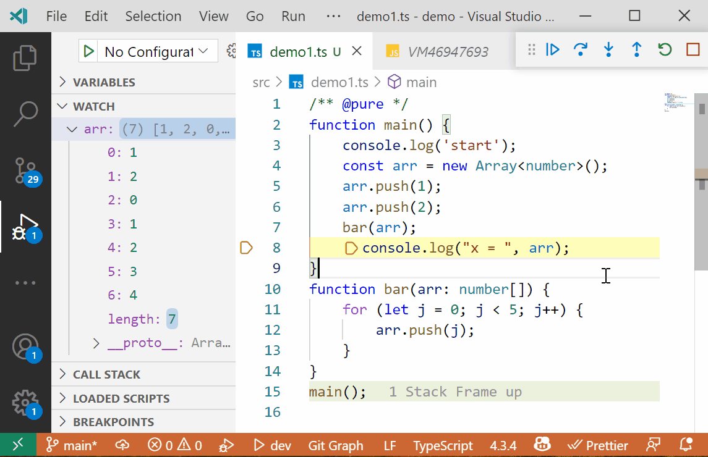

# DeLorean JS Debug: Step Back In (Pure) Functions

[](https://github.com/sponsors/hediet)
[](https://www.paypal.com/cgi-bin/webscr?cmd=_s-xclick&hosted_button_id=ZP5F38L4C88UY&source=url)
[](https://twitter.com/intent/follow?screen_name=hediet_dev)



## Usage

Only works with TypeScript and requires custom transformers!
You can step back in any function, but global side effects are not reversed.

Annotate functions/methods with `/** @pure */` to indicate that they are pure (for example test methods are usually pure).
If there is a pure function/method on the stack, stepping back will restart the most recently called pure function to reverse local side effects.

Install `@hediet/delorean-debug-transformer` and add it to your `tsconfig.json`:

```json
{
	"compilerOptions": {
		"plugins": [{ "transform": "@hediet/delorean-debug-transformer" }],
		"outDir": "out",
		"target": "es5",
		"module": "commonjs",
		"strict": true,
		"inlineSourceMap": true
	},
	"include": ["./src/**/*"]
}
```

Install `ts-patch` and run `ts-patch install` to make `tsc` consider `plugins`.
I recommend to do that in a `postinstall` script (see demo).

## Demo

See [demo](https://github.com/hediet/vscode-delorean-js-debug/tree/main/demo).
